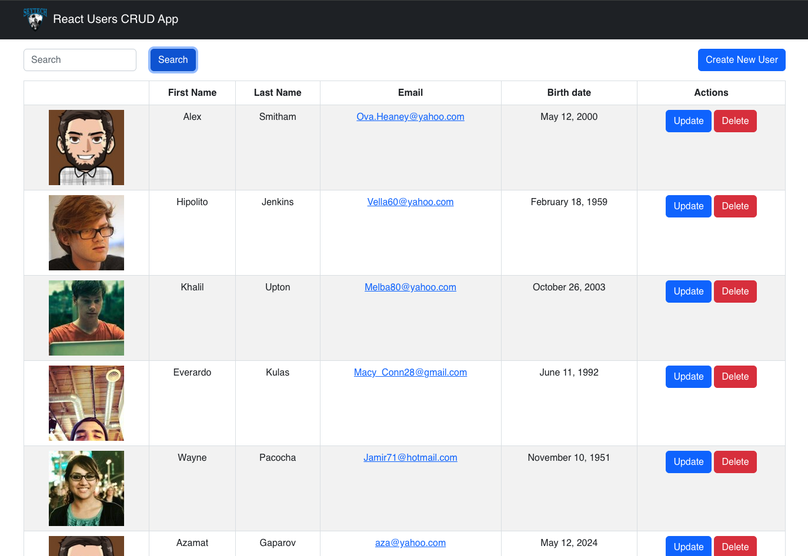
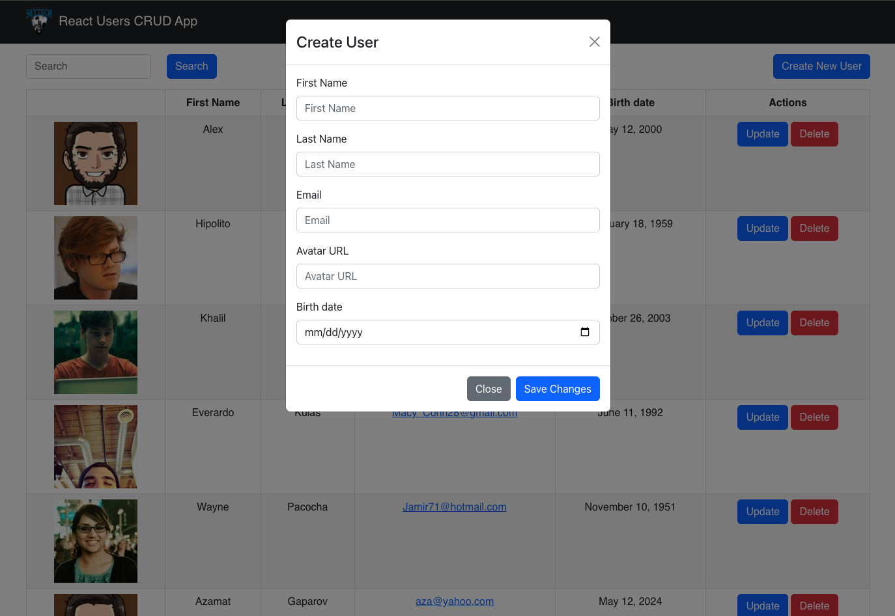
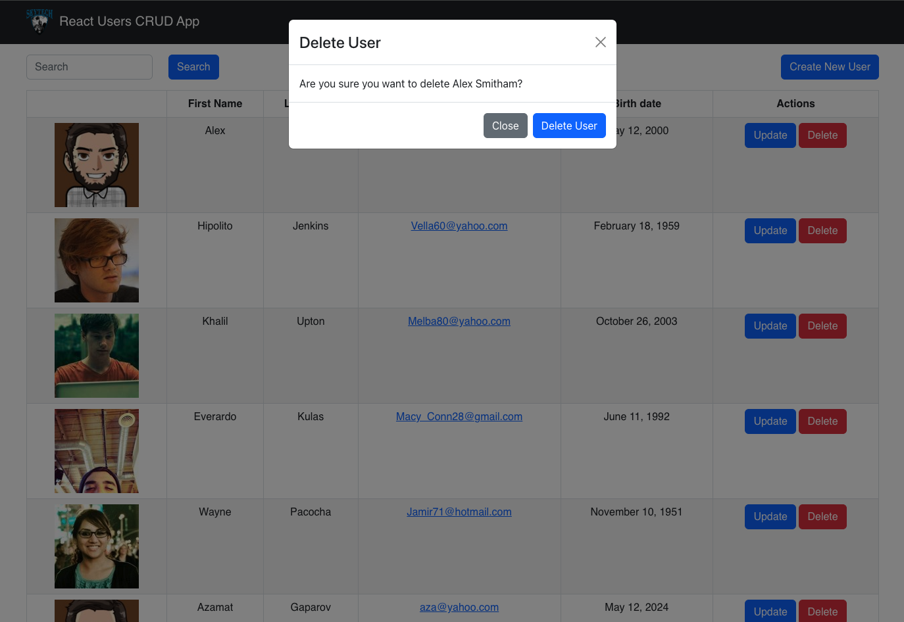

# React Users CRUD App

- This project was deployed using `surge`, refer to this link to get more info on [surge.sh](https://surge.sh/)
  - - Also refer to this article to deploy a React App using `surge` and `github pages` [Link](https://www.freecodecamp.org/news/surge-vs-github-pages-deploying-a-create-react-app-project-c0ecbf317089):
  - - Deployed demo UI can be viewed here: [used-grandfather.surge.sh](used-grandfather.surge.sh)

## Available scripts to run this project

- Git clone the project to your local machine/laptop.
- Go into the project directory.
- In the project directory, you can run:

### `npm install`

### `npm start`

Runs the app in the development mode.\
Open [http://localhost:3000](http://localhost:3000) to view it in your browser.

The page will reload when you make changes.\
You may also see any lint errors in the console.

### UI views

### Create New User

### Update User

### Delete User

